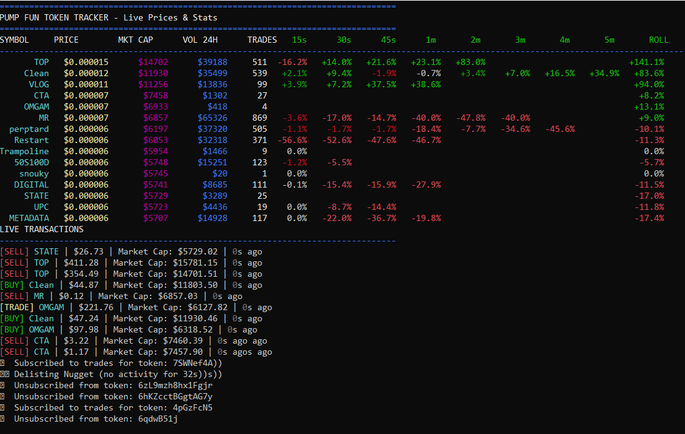

# PopTrade

 tool to scrape & aggregate brand new SOL-based cryptocurrencies published on pump.fun, from ~$0-80k market cap, with a simple command prompt ui, written in rust. ~24 hour project written in september 2025. MIT License. Tested only in Windows 10.0.19045.





## Prerequisites

- **Rust**: You need to have Rust installed on your system. Install it from https://rust-lang.org/

## Running the Application

### 1. Build the project
```bash
cargo build --release
```

### 2. Run the token tracker
```bash
cargo run
```

## What it does

Runs a real-time cryptocurrency token tracker that monitors tokens exclusively while they're listed on https://pump.fun/ (typically from launch to ~80-100k market cap). Stores data from EVERY trade of EVERY non-inactive new coin in .csv files in a fairly lightweight manner (~8 MB per hour), and automatically subscribes to new coins and unsubscribes from inactive coins.

## Features

- Real-time WebSocket connection to cryptocurrency exchange
- Terminal-based interface with colored output (1-2 mini UI bugs pending fix)
- Web API server for querying token data (work in progress)
- Data export to .csv format
- Live price and volume tracking

## Usage

Once running, the application will display real-time token information in your terminal, and (work in progress) start up a web server for API access.

Press `Ctrl+C` to stop the application.

## Known Bugs

- Stale text lingering in the "live transactions" section
- Upper border has lingering old text if the command prompt window is resized during use
